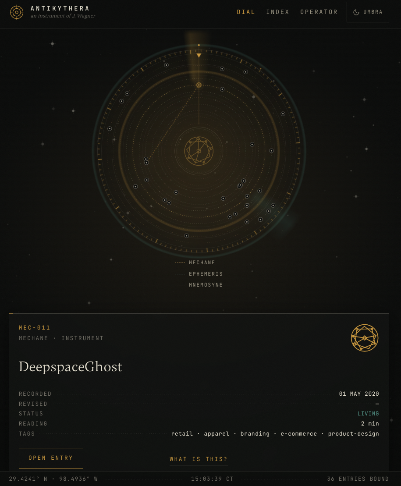

# Antikythera Template

An experimental, mathematical, local-first portfolio and blog architecture. 

This engine was originally designed and built as the custom, personal portfolio and blog for [Jonathan J. Wagner](https://jonathanjwagner.alien.engineer). Because the architecture is entirely serverless, database-free, and relies purely on visible mathematical mechanics to organize content, it has been open-sourced here as a blank-slate template for others to tinker with, customize, and deploy for their own purposes.

Rather than using an opaque algorithm or a hidden backend database to organize your writing, this site provides a literal readout of the data underneath. There is no build step, no framework, and no database. The site is driven entirely by static Markdown files and a simple JSON manifest.

**[View the live DEMO of the original, fully customized deployment here](https://jjwagner.vercel.app)**



## Form and Function

The site operates like a celestial instrument (inspired by the ancient Antikythera mechanism):
- **The Angle:** The exact day of the year an article was published dictates its rotation (`theta`) around the dial.
- **The Rings:** The category (sphere) places it on a specific colored orbit (`radius`).
- **The Resonance:** Dashed lines connecting certain nodes represent cross-references (`resonance` in frontmatter) between related articles.

## How to Run Locally

You only need to serve the static folder. You do not need `npm install` or any build tools.

```bash
npx serve . -l 3000 --single
```
Then open `http://localhost:3000` in your browser.

## Adding Content

Content lives in the `content/` directory as plain Markdown files with a strict YAML-like frontmatter. 

### 1. Create a Markdown File
Example: `content/my-new-post.md`

```text
---
title: "My New Post"
designation: MEC-002
slug: my-new-post
sphere: mechane
kind: tool
date: 2026-10-01
status: living
sigil: 123456
reading: 5
summary: "A brief description of this post."
tags: [architecture, design]
---

Your markdown content goes here.
```

### 2. Update `manifest.json`
Every Markdown file must be registered in `content/manifest.json` under the `entries` array:
```json
  "entries": [
    "example-instrument.md",
    "my-new-post.md"
  ]
```

### 3. Validate Content
To ensure your frontmatter and links are correct, run the included validator:
```bash
node tools/validate-content.mjs
```

## Customization

- **Colors & Themes:** Modify `style.css` to change the `--color-*` CSS variables.
- **Spheres:** Define your own categories in `content/manifest.json` under the `spheres` array.
- **Operator Page:** Update the `operator` block in `content/manifest.json` and edit the raw HTML in `app.js` (`viewOperator` function) to add your own personal links.
- **Intro Dialog:** Edit the `introMarkup` function in `app.js` to change the welcome text.

## Deployment

Deploy anywhere that hosts static files (GitHub Pages, Vercel, Netlify). 
No build command is necessary. Set your publish directory to the root of the repository (`.`).
